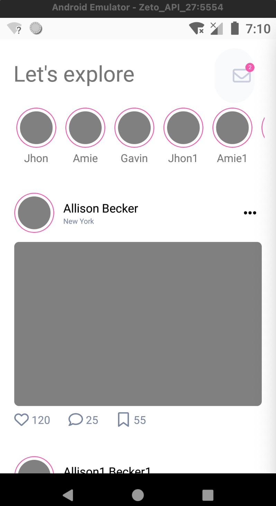
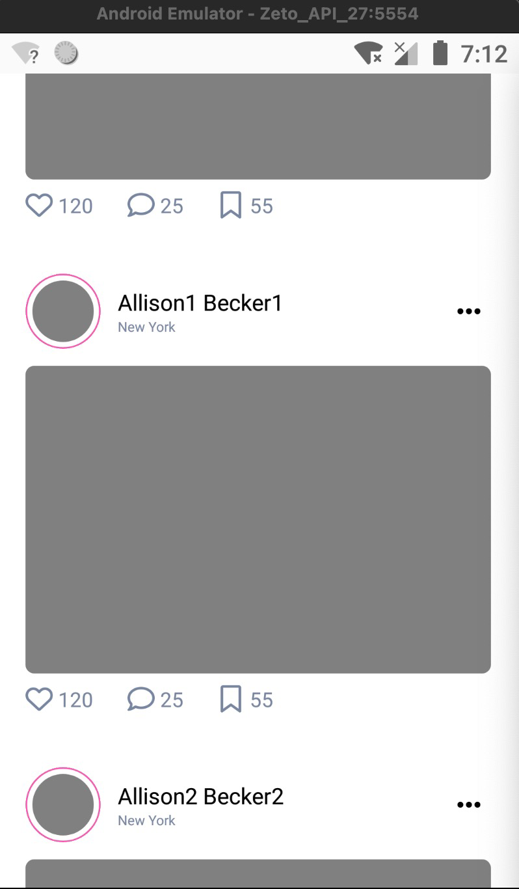
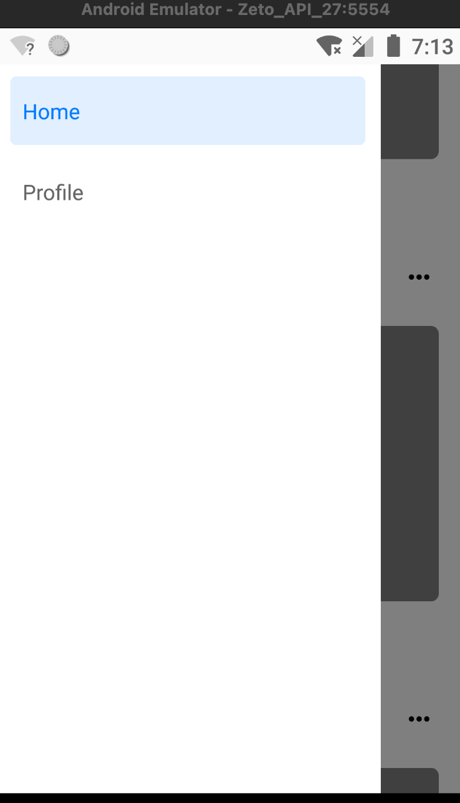
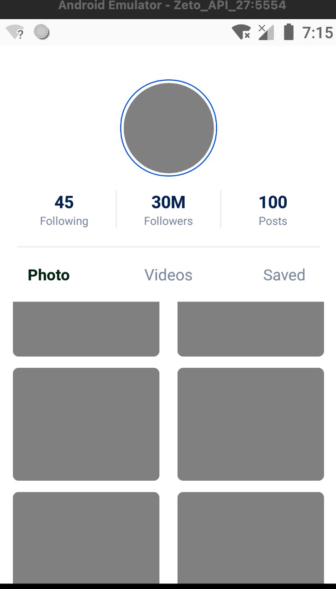

## 仿 Instagram 主页和个人页 的 RN 实现

## 项目简介

Udemy 中的 RN 教学课程的个人练习项目: 

React Native: Mobile App Development (CLI) [2024]

https://www.udemy.com/course/react-native-mobile-app-development/?couponCode=MTST7102224A2

在这个项目中, 对各种 RN 组件和 component 封装进行了练习.

对列表也实现了分页拉取数据. 

## SocialMediaApp 效果展示: 

### 主页1

### 主页2

### 导航

### 个人页

